# Data Sent to Lightroom After AI Analysis

This document traces every piece of data that flows from the AI engine back into Lightroom Classic, from the Gemini response through the `response.json` bridge file and into the Lua plugin.

---

## End-to-End Pipeline

```mermaid
flowchart LR
    A["Gemini API"] -->|JSON| B["geminiService.js"]
    B -->|parsed object| C["aiAnalysisService.js"]
    C -->|metadata| D["app.js renderer"]
    D -->|responseData| E["main.js IPC"]
    E -->|writes file| F["response.json"]
    F -->|polled & read| G["ProcessImages.lua"]
    G -->|SDK calls| H["Lightroom Catalog"]
```



---

## 1. AI Output — Gemini JSON Schema

The prompt in [aiAnalysisService.js](file:///Volumes/ATOM%20RAID/Dropbox/_Personal%20Files/12%20-%20AI%20Vibe%20Coding/07%20-%20Anti%20Gravity/05%20-%20Lightroom%20%20Plug-in/src/services/aiAnalysisService.js#L132-L162) requests this exact JSON structure from the model:

| Field | Type | Example |
|---|---|---|
| `title` | `string` | `"Control Room 4, Chernobyl NPP"` |
| `caption` | `string` | `"A haunting view of the reactor…"` |
| `description` | `string` | Full paragraph description |
| `keywords` | `string[]` | `["Chernobyl", "reactor", "abandoned"]` |
| `location` | `string \| null` | `"Chernobyl Exclusion Zone, Ukraine"` |
| `gps` | `{latitude: number, longitude: number}` | `{"latitude": 51.3895, "longitude": 30.0991}` |
| `technicalDetails` | `string \| null` | Lighting / composition notes |
| `confidence` | `number` (0–1) | `0.95` |
| `uncertainFields` | `string[]` | `["location"]` |

> [!NOTE]
> `technicalDetails`, `confidence`, and `uncertainFields` are used **only inside the Electron app** for display / decision-making. They are **not** forwarded to Lightroom.

---

## 2. Renderer Assembly — `response.json` Payload

In [app.js `handleGenerateAllXMP()`](file:///Volumes/ATOM%20RAID/Dropbox/_Personal%20Files/12%20-%20AI%20Vibe%20Coding/07%20-%20Anti%20Gravity/05%20-%20Lightroom%20%20Plug-in/src/renderer/app.js#L4732-L4799), the renderer maps each analyzed cluster's metadata onto **every file path** in that cluster (main rep, bracketed images, similar reps, derivatives) and builds:

```json
{
  "images": [
    {
      "path":         "/absolute/path/to/IMG_1234.CR3",
      "keywords":     ["keyword1", "keyword2"],
      "title":        "Descriptive title",
      "caption":      "Short caption (falls back to description)",
      "gpsLatitude":  51.3895,
      "gpsLongitude": 30.0991
    }
  ]
}
```

### Field Mapping (AI → response.json)

| response.json field | Source from AI metadata | Notes |
|---|---|---|
| `path` | Cluster file paths | Every image in the super-cluster receives the same metadata |
| `keywords` | `metadata.keywords` | Array of strings, defaults to `[]` |
| `title` | `metadata.title` | Defaults to `""` |
| `caption` | `metadata.caption ∥ metadata.description` | Falls back to `description` if `caption` is missing |
| `gpsLatitude` | `metadata.gps.latitude` | `null` if unavailable |
| `gpsLongitude` | `metadata.gps.longitude` | `null` if unavailable |

> [!IMPORTANT]
> Fields from the AI output that are **not** forwarded to Lightroom:
> `description`, `location`, `technicalDetails`, `confidence`, `uncertainFields`

---

## 3. File Bridge — `response.json`

Written by [main.js `write-lightroom-response`](file:///Volumes/ATOM%20RAID/Dropbox/_Personal%20Files/12%20-%20AI%20Vibe%20Coding/07%20-%20Anti%20Gravity/05%20-%20Lightroom%20%20Plug-in/src/main/main.js#L2267-L2279) to:

```
~/Documents/LR_AI_Temp/response.json
```

The Lua plugin polls this location every **5 seconds** for up to **30 minutes**.

---

## 4. Lua Consumer — What Lightroom Actually Receives

[ProcessImages.lua](file:///Volumes/ATOM%20RAID/Dropbox/_Personal%20Files/12%20-%20AI%20Vibe%20Coding/07%20-%20Anti%20Gravity/05%20-%20Lightroom%20%20Plug-in/AI_Meta_Tagger.lrdevplugin/ProcessImages.lua#L93-L142) reads `response.json` and applies metadata via the Lightroom SDK:

| Lightroom SDK Call | Source Field | Behavior |
|---|---|---|
| `catalog:createKeyword()` + `photo:addKeyword()` | `item.keywords` | Each keyword string is sanitized (commas/pipes stripped) and added individually. Duplicates are handled by Lightroom. |
| `photo:setRawMetadata('title', …)` | `item.title` | Set only if non-empty string |
| `photo:setRawMetadata('caption', …)` | `item.caption` | Set only if non-empty string |
| `photo:setRawMetadata('gps', {latitude, longitude})` | `item.gpsLatitude`, `item.gpsLongitude` | Set only if both values are valid numbers |

### Summary of What Lands in Lightroom

| Lightroom Metadata Field | Written? | IPTC / XMP Mapping |
|---|---|---|
| **Title** | ✅ | `dc:title` |
| **Caption** | ✅ | `dc:description` |
| **Keywords** | ✅ | `dc:subject` / Lightroom Keyword hierarchy |
| **GPS Coordinates** | ✅ | `exif:GPSLatitude`, `exif:GPSLongitude` |
| Description (long) | ❌ | Not sent — `caption` is used instead |
| Location name | ❌ | Not sent |
| Technical details | ❌ | Not sent |
| Confidence / uncertain | ❌ | Internal only |

---

## 5. Edge Cases & Safety

- **Early quit**: If the Electron app is closed before analysis completes, `main.js` writes an empty `{ "images": [] }` response so the Lua polling loop exits cleanly.
- **Keyword sanitization**: The Lua plugin strips `,` and `|` characters from keywords to prevent Lightroom SDK assertion failures.
- **All SDK writes are wrapped in `pcall()`** to prevent a single bad field from aborting the entire batch.
- **Photo matching**: Each response item is matched to its catalog photo by comparing `item.path` against `photo:getRawMetadata('path')`.
